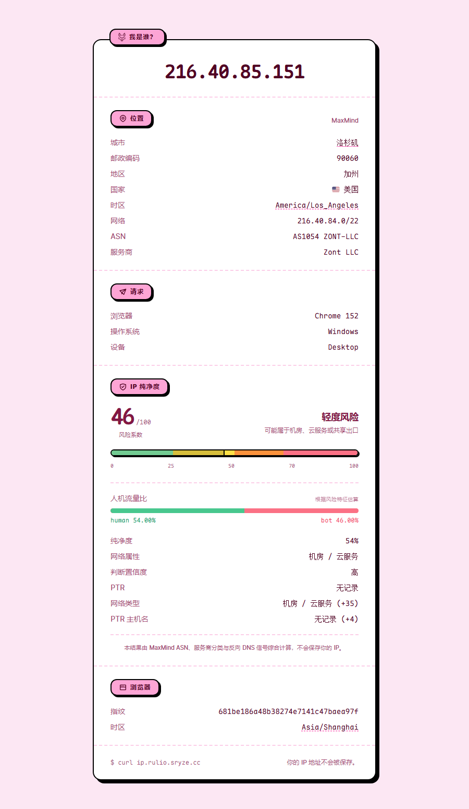

# WhoAmI Pure

<p align="center">
  <strong>真实 IP、地理位置、浏览器指纹与 IP 纯净度检测服务</strong>
</p>

<p align="center">
  <a href="https://ip.rulio.sryze.cc">在线演示</a> ·
  <a href="#快速开始">快速开始</a> ·
  <a href="#宝塔面板部署">宝塔部署</a> ·
  <a href="#cloudflare-tunnel-免费部署">Cloudflare Tunnel</a>
</p>


> 在线站点：[https://ip.rulio.sryze.cc](https://ip.rulio.sryze.cc)



## 项目简介

WhoAmI Pure 是一个可自行部署的 IP 信息检测站。浏览器访问时显示完整的可视化面板，`curl` 访问根路径时直接返回纯文本 IP。

项目由 Cloudflare Tunnel 接收公网请求，通过 `CF-Connecting-IP` 获取真实客户端 IP；Node.js/Express 在服务端查询本地 MaxMind GeoLite2 City 与 ASN 数据库并渲染页面。浏览器端使用 htmx、hx-live 和 FingerprintJS 完成异步 PTR、纯净度与指纹展示。

IP 纯净度由本地 ASN、服务商分类和 PTR 反向 DNS 信号计算，不依赖收费在线接口。人机流量比例是基于相同风险信号生成的**估算值**，不是第三方平台的真实全网流量统计。

## 功能特色

- **真实客户端 IP**：Cloudflare CDN/Tunnel 后仍可读取 `CF-Connecting-IP`。
- **curl 与浏览器分流**：浏览器返回 HTML，命令行请求返回纯文本 IP。
- **本地地理数据库**：城市、地区、国家、时区、经纬度、网段、ASN 和服务商。
- **PTR 反向解析**：异步查询主机名，内置超时保护，不阻塞首屏。
- **IP 纯净度**：输出 0–100 风险系数、纯净度、风险等级和解释因子。
- **网络属性识别**：住宅/运营商、商业网络、机房/云服务及匿名代理。
- **人机流量比**：绿色 `human` 与红色 `bot` 比例条，保留两位小数。
- **浏览器指纹**：FingerprintJS visitor ID、浏览器、系统、设备和时区。
- **隐私优先**：应用不把访问者 IP 写入数据库或业务日志。
- **首屏性能**：服务端渲染主要信息；PTR、纯净度和指纹异步加载。
- **静态资源长缓存**：带内容哈希的 JS/CSS/字体支持一年 immutable 缓存。
- **容器化部署**：包含 Dockerfile、Docker Compose 和健康检查。
- **免费公网接入**：支持 Cloudflare Tunnel，无须开放应用端口或配置源站证书。

## 技术架构

```text
Browser / curl
      │ HTTPS
      ▼
Cloudflare CDN + Tunnel
      │ CF-Connecting-IP
      ▼
Node.js 22 + Express 5
      ├── 服务端 HTML / JSON
      ├── MaxMind GeoLite2 City
      ├── MaxMind GeoLite2 ASN
      ├── PTR 反向 DNS
      └── IP 纯净度评分与缓存
             │
             ▼
      htmx + hx-live + FingerprintJS
```

应用默认仅映射到 `127.0.0.1:3000`。Cloudflare Tunnel 容器通过 Docker 内部网络访问 `http://whoami:3000`，公网无法绕过 Cloudflare 直接伪造真实 IP 请求头。

## 环境要求

### 直接运行

- Node.js 22 或更高版本
- npm 10 或更高版本

### Docker 部署

- Docker Engine 24+
- Docker Compose v2
- Cloudflare 账户和一个已托管的域名（使用 Tunnel 时）

## 快速开始

```bash
git clone https://github.com/Rulio723/whoami-ip-purity.git
cd whoami-ip-purity
npm ci
npm test
npm start
```

浏览器打开：

```text
http://127.0.0.1:3000
```

命令行测试：

```bash
curl http://127.0.0.1:3000
curl http://127.0.0.1:3000/healthz
curl http://127.0.0.1:3000/api/info
curl http://127.0.0.1:3000/api/purity
```

### 使用固定 IP 调试

PowerShell：

```powershell
$env:DEV_IP_OVERRIDE='216.40.85.151'
npm start
```

Linux/macOS：

```bash
DEV_IP_OVERRIDE=216.40.85.151 npm start
```

## 环境变量

复制示例配置：

```bash
cp .env.example .env
```

| 变量 | 默认值 | 说明 |
| --- | --- | --- |
| `PORT` | `3000` | Node.js 监听端口 |
| `HOST` | `0.0.0.0` | Node.js 监听地址 |
| `TRUST_CF_CONNECTING_IP` | `true` | 是否信任 Cloudflare 真实 IP 请求头 |
| `DEV_IP_OVERRIDE` | 空 | 开发环境固定查询 IP |
| `CLOUDFLARE_TUNNEL_TOKEN` | 空 | Cloudflare Tunnel 令牌 |
| `MAXMIND_CITY_DB` | 内置数据库 | 自定义 City MMDB 路径 |
| `MAXMIND_ASN_DB` | 内置数据库 | 自定义 ASN MMDB 路径 |

不要提交包含 Tunnel Token、MaxMind License Key 或其他密钥的 `.env`。

## Docker Compose 部署

创建 `.env`：

```dotenv
CLOUDFLARE_TUNNEL_TOKEN=替换为你的Tunnel令牌
MAXMIND_CITY_DB=
MAXMIND_ASN_DB=
```

启动：

```bash
docker compose up -d --build
docker compose ps
docker compose logs --tail=100
curl http://127.0.0.1:3000/healthz
```

更新：

```bash
git pull
docker compose up -d --build
docker image prune -f
```

停止：

```bash
docker compose down
```

## 宝塔面板部署

### 1. 安装运行环境

在宝塔面板的软件商店安装：

- Docker 管理器
- Git（系统未安装时）

也可以直接在宝塔终端执行：

```bash
apt update
apt install -y git
```

CentOS/AlmaLinux 使用：

```bash
dnf install -y git
```

### 2. 下载项目

```bash
mkdir -p /www/wwwroot
cd /www/wwwroot
git clone https://github.com/Rulio723/whoami-ip-purity.git whoami
cd whoami
```

### 3. 配置密钥

```bash
cp .env.example .env
nano .env
```

至少填写：

```dotenv
CLOUDFLARE_TUNNEL_TOKEN=你的CloudflareTunnel令牌
```

限制权限：

```bash
chmod 600 .env
```

### 4. 构建并启动

```bash
cd /www/wwwroot/whoami
docker compose up -d --build
docker compose ps
```

正常状态应包含：

```text
whoami        healthy
cloudflared   running
```

### 5. 宝塔防火墙

通过 Cloudflare Tunnel 部署时不需要放行 `3000` 端口。应用仅绑定服务器环回地址：

```text
127.0.0.1:3000
```

SSH 和宝塔面板端口按自己的管理需求保留即可。

### 6. 常用维护命令

```bash
cd /www/wwwroot/whoami

docker compose ps
docker compose logs --tail=100
docker compose restart
docker compose up -d --build
```

## Cloudflare Tunnel 免费部署

### 1. 创建 Tunnel

进入 Cloudflare Zero Trust：

```text
Networks → Tunnels → Create a tunnel → Cloudflared
```

输入 Tunnel 名称并复制生成的 Token。

### 2. 添加公网主机名

在 Tunnel 的 `Public Hostname` 中添加：

| 配置 | 示例 |
| --- | --- |
| Subdomain | `ip` |
| Domain | `example.com` |
| Type | `HTTP` |
| URL | `whoami:3000` |

最终地址示例：

```text
https://ip.example.com
```

### 3. 写入 Token

```bash
cd /www/wwwroot/whoami
cp .env.example .env
```

```dotenv
CLOUDFLARE_TUNNEL_TOKEN=粘贴完整Token
```

### 4. 启动 Tunnel

```bash
docker compose up -d --build
docker compose logs cloudflared --tail=100
```

日志出现 `Registered tunnel connection` 表示连接成功。Cloudflare 会自动创建代理 DNS 记录并提供 HTTPS。

### 5. 推荐 CDN 缓存规则

只缓存静态资源：

```text
/assets/*
/logo.svg
/og.png
```

首页、`/hostname`、`/purity` 和 `/api/*` 必须保持动态，避免把其他访问者的 IP 信息缓存给当前用户。

验证响应：

```bash
curl -I https://ip.example.com/
curl -I https://ip.example.com/logo.svg
```

首页应为：

```text
Cache-Control: no-store
cf-cache-status: DYNAMIC
```

静态资源第二次访问通常为：

```text
cf-cache-status: HIT
```

## API

### `GET /`

- 请求头包含 `Accept: text/html`：返回完整网页。
- 其他请求：返回纯文本客户端 IP。

```bash
curl https://ip.example.com
```

### `GET /api/info`

返回 IP、城市、国家、ASN、网段、服务商、浏览器和设备信息。

### `GET /api/purity`

返回纯净度检测结果：

```json
{
  "ip": "216.40.85.151",
  "riskScore": 46,
  "purityScore": 54,
  "humanTraffic": 54,
  "botTraffic": 46,
  "level": "轻度风险",
  "networkType": "机房 / 云服务",
  "confidence": "高",
  "hostname": ""
}
```

### `GET /hostname`

返回 PTR 反向 DNS 主机名；无记录或查询超时时返回空文本。

### `GET /purity`

返回供 htmx 异步加载的纯净度 HTML 片段。

### `GET /healthz`

```json
{
  "status": "ok",
  "database": "MaxMind GeoLite2 City + ASN"
}
```

## 纯净度计算说明

风险系数范围为 `0–100`，分数越高代表代理、机房或匿名网络特征越明显。

| 风险系数 | 等级 |
| --- | --- |
| 0–15 | 纯净 |
| 16–25 | 极低风险 |
| 26–40 | 低风险 |
| 41–50 | 轻度风险 |
| 51–70 | 中度风险 |
| 71–85 | 高风险 |
| 86–100 | 极高风险 |

当前参与计算的信号：

- 已知云服务和托管 ASN
- ASN 服务商名称中的机房、云、VPN、代理和 Tor 特征
- 住宅宽带、移动网络和运营商名称特征
- PTR 主机名中的动态地址池、服务器和匿名网络特征
- ASN 和注册国家信息是否完整

`humanTraffic + botTraffic = 100`。当前人机比例从风险系数推导并在页面中标注为估算值，不应当作为广告结算、反欺诈封禁或司法判断的唯一依据。

## MaxMind 数据库更新

默认依赖已经携带 GeoLite2 City 和 ASN 数据库。使用自己的 MaxMind 账户更新：

```bash
MAXMIND_ACCOUNT_ID='账户ID' \
MAXMIND_LICENSE_KEY='LicenseKey' \
npm run maxmind:update
```

生成文件：

```text
databases/GeoLite2-City.mmdb
databases/GeoLite2-ASN.mmdb
```

在 `.env` 指向容器路径：

```dotenv
MAXMIND_CITY_DB=/app/databases/GeoLite2-City.mmdb
MAXMIND_ASN_DB=/app/databases/GeoLite2-ASN.mmdb
```

## 测试

```bash
npm test
```

测试覆盖：

- Cloudflare 真实 IP 提取
- HTML、纯文本和 JSON 响应
- MaxMind City/ASN 查询
- PTR 成功、失败与超时
- Bot User-Agent 识别
- 住宅、机房和匿名代理纯净度评分
- 人机流量比例
- 查询缓存去重

生产镜像在 Docker 构建阶段也会执行全部测试，测试失败时镜像不会生成。

## 项目结构

```text
assets/              字体、图标、样式和 Open Graph 图片
client.js            htmx、hx-live 与 FingerprintJS 浏览器入口
src/app.js           Express 路由和响应头
src/ip.js            真实 IP 与 User-Agent 解析
src/hostname.js      有超时保护的 PTR 查询
src/maxmind.js       MaxMind MMDB 加载和查询
src/purity.js        IP 纯净度、人机比例和结果缓存
src/template.js      服务端 HTML 与纯净度片段
scripts/build.mjs    Vite 和静态资源构建
tests/               Node.js 自动化测试
Dockerfile           多阶段生产镜像
compose.yaml         应用与 Cloudflare Tunnel
```

## 故障排查

### 页面显示的是 Docker 内网 IP

确认公网流量确实经过 Cloudflare，并且：

```dotenv
TRUST_CF_CONNECTING_IP=true
```

不要把应用的 `3000` 端口直接暴露给不可信公网。

### Tunnel 无法连接应用

Public Hostname 的目标必须使用 Docker 服务名：

```text
http://whoami:3000
```

不要在 cloudflared 容器中使用 `127.0.0.1:3000`，该地址会指向 cloudflared 容器自身。

### MaxMind 数据库不存在

```bash
npm ci
npm run maxmind:update
```

或检查 `MAXMIND_CITY_DB`、`MAXMIND_ASN_DB` 是否指向容器内有效文件。

## 隐私与说明

- 应用本身不持久化访问者 IP。
- Cloudflare、服务器反向代理及容器运行时可能保留基础访问日志，应按实际需求配置日志周期。
- IP 地理位置和纯净度都是推断结果，无法保证与物理位置或第三方风控平台完全一致。
- 项目参考了 `whoami.moe` 与 `IPPure` 可公开观察的交互形式，没有使用或声称拥有其私有服务端源码、数据库或评分算法。

## License

[MIT](LICENSE) © 2026 Rulio723
